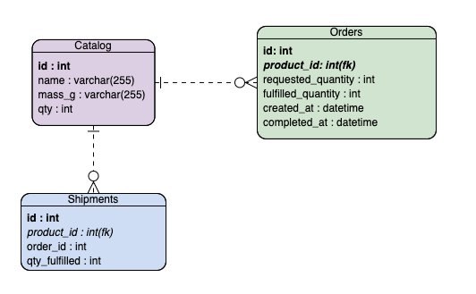

<!-- ABOUT THE PROJECT -->
## Vincent Nguyen - Zipline Logistic Take Home 

## Requirements

Listed below are the key requirements for the inventory management and order processing system: 

* Manage an inventory of products
* Keep track of which items have been stocked
* Transforming incoming orders into outgoing shipments as appropriate 

Edge cases to consider
* Max package size is 1.8kg, therefore breaking order into mulitple packages 
* Out of inventory, in which case we ship what we can, and then wait until a restock happens
* When a restock happens, ship out pending items that weren't fulfilled immediately 


## Diagrams

#### Sequence Diagram


#### DB Diagram


## Completed
**Init_catalog** - will initially populate **(product-info)** to the `catalog table` with the initial quantity of 0 for each product type

**Process_order** - will primarily the follow key things
  1.  Checks to see if the order received is a new or existing pending order 
    * If new order, saves to orders table before querying
    * If existing order, queries table 
    * I'm only pulling orders that have `outstanding qty` of products that needs to be fulfilled  
  
  2. Go through the order 1 qty at a time

  3. Check if we have stock for 1 qty of the product and if we do 
     * If adding 1 qty of the item doesn't exceed 1800g shipment package, then we add
     * Else if adding the 1 qty of the item to the shipment package > 1800g, then we ship out the package we have 

  4. We invoke ShipAPI as many times as we need - continously updating the `outstanding qty` field of our orders table 

  **Connected to DB** - Both of the routes mentioned above have a fully functional PostgresSQL DB hosted on ElephantSQL 

## Not Completed
**Init_catalog** - I did not have time to finish coding this out, but have included my pseudo code as to how I might have approached it with more time 

**Typescript** - Added types where I could but not fully exhaustive 

### Optimizations Considerations 
1. Where possible - I considered doing a bulk add of information to the DB to minimize hitting the DB frequently, I implemented this in **init catalog** 

2. Because I'm iterating through 1 quantity of each product during **process_order** at a time and making multiple requests to the DB, this could lead to a heavy load on the DB and not the most optimal. I took a very brute force solution to the problem 

3. I'm aware that this could be a relevant knapsack algorithm which I could have approached to further optimize the system. Rather than hitting the DB with each iteration, I can decide what products go in my package, how my packages are most optimally split, and then invoke the shipAPI. 


### Installation 

1. Hosted my DB on ElephantSQL, you can connect in your terminal using the command 

```JS
psql postgres:ekwmfpwq:cnGh7BO3pHq6XaPX_Zh1b5yyUlglaNV3@raja.db.elephantsql.com:5432/ekwmfpwq;
```

2. The catalog DB has already initially been populated with the data with Qty 0 

3. If you would like to run through the process, please manually add `qty` to the product_id of the catalog. Ideally, **process_restock** would have adding the qty to the catalog table. 

4. Send an order in and you should see the shipments table populate based on the packages that get sent 